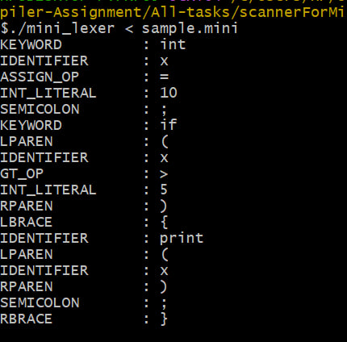

This project contains various lex programs for different tasks.

## Programs included

- Vowel and consonant counter
- Number classifier (positive/negative integers and fractions)
- Language recognizer (C, C++, Java)
- MINI language scanner

## How to run

```bash
gcc lex.yy.c -o my_program
./my_program inputfile


```markdown
